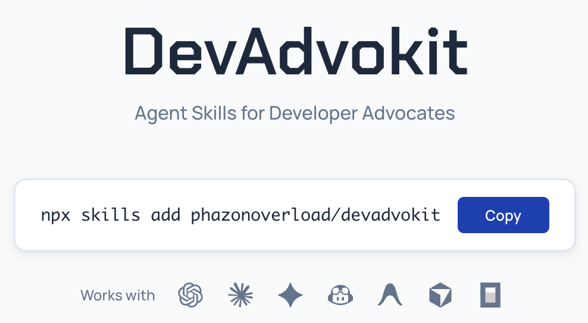
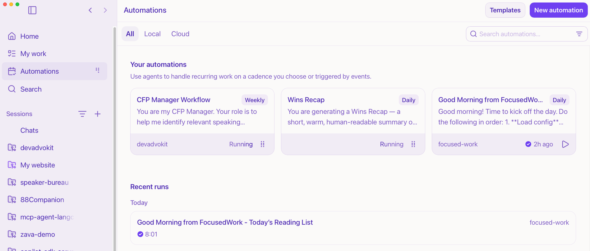
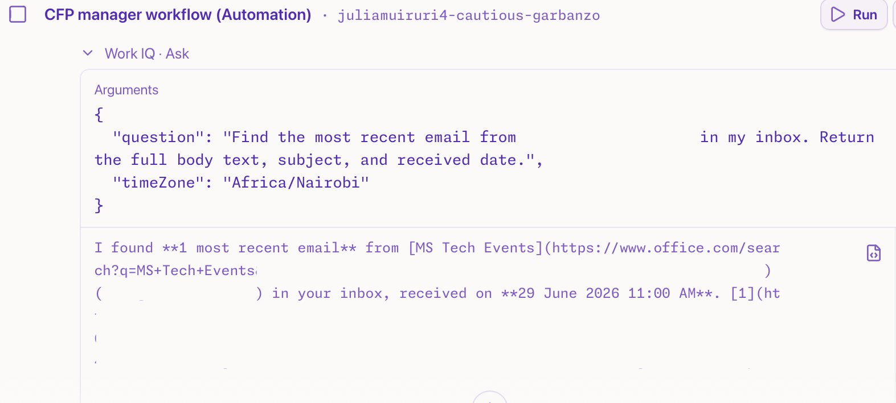
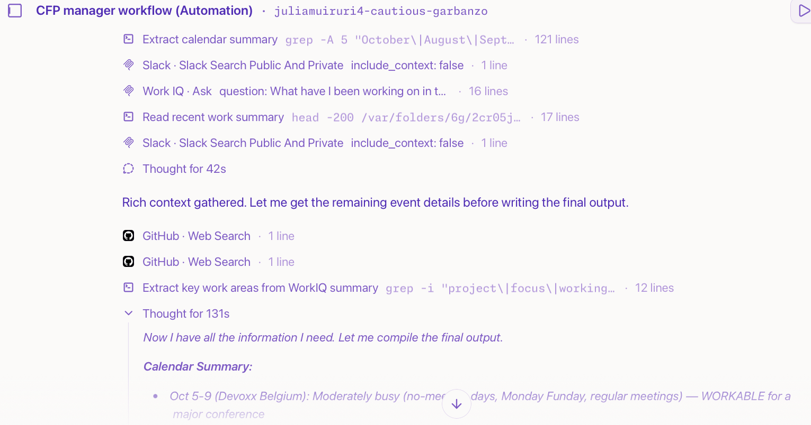
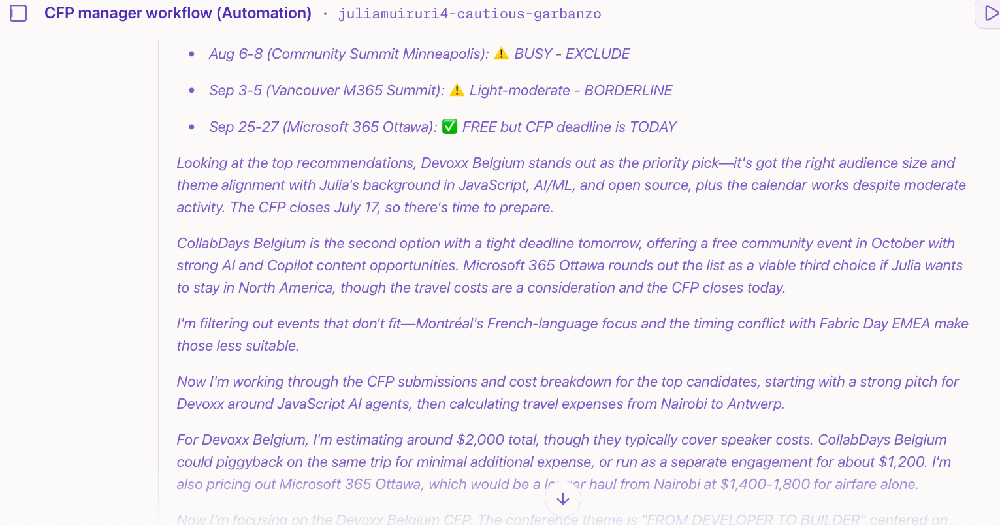

It's Monday morning, and I'm getting ready to kick off the week. My inbox is mostly peaceful on Mondays, not many comms go out on Fridays, but there is this one email I always get every start of the week.

<figure class="img-sm">


</figure>

I'm subscribed to an internal Tech Events Call for Proposals and event support list that goes out every week.

My Monday morning routine includes something like this:

- I open the email from MS Tech Events and quickly scan the table to *eliminate events that don't align with my work*,
- Click each CFP link for *more details on the event & requirements*,
- Having identified good speaking opportunities, I quickly c*onfirm my availability* from my work calendar,
- If my schedule allows, I *talk to my manager for review and approval*,
- With my manager's approval, I *find available resources to repurpose & reuse* (deck & demo), then *draft a talk submission* aligning with both the product narrative (internal), target audience needs and conference guidelines (external), and then submit,
- Upon acceptance, *I open an issue in our internal events repo,* logging the event for tracking & other logistics (travel, hotel etc.)

This is valuable work, which I don't consider to be difficult, but it can easily end up taking longer than I'd like it to, wasting a considerable amount of time every week before I start feeling productive.

I sometimes completely miss a CFP window because I launched the CFP link on the browser, thinking I'd get to it later, only to have it buried in the hundreds of tabs open. So I thought, "this looks like a good candidate for a quick workflow automation."

## Designing the workflow

I recently came across [DevAdvokit](https://devadvokit.com/), open-sourced Agent Skills created by [Kelvin](https://github.com/phazonoverload), a Senior Developer Advocate at Apify.



These skills are designed to help Developer Relations professionals automate their workflows, and it seemed like a good fit for my CFP Manager workflow.

After installation, the skills now show up in the [GitHub Copilot App](https://gh.io/app) and I can send off my agent to create quality DevRel assets following customized guidelines.
The first step is to run `/setup-devadvokit` to generate a `.devadvocakit.md` file with my professional context. This file is used by the DevAdvokit skills to understand my work, interests and goals, so it can generate relevant content for me.


The GitHub Copilot App has a neat **Automations** feature that allows you to easily create automations with:

- A trigger (e.g., manual, on a schedule, CRON job etc)
- Prompt
- Configuration (e.g., which mode to run in, which project to use, which model etc.)
- Optional allow **Run in the cloud** to run the automation on GitHub's servers, so its not dependent on your computer being on.



Here is a breakdown of the workflow I created, along with how the agent performed on my first run.

<!-- markdownlint-disable MD033 -->
<details>
  <summary><strong>Prompt setting context and pulling email</strong></summary>

```text
You are my CFP Manager. Your role is to help me identify relevant speaking opportunities from the weekly msTE Call for Proposals and Event Support email, assess whether they align with my work and draft strong CFP submissions.

## Context

I am subscribed to an internal Tech Events Call for Proposals and Event Support email from [@email]. The email is sent every Monday and includes upcoming speaking opportunities, event support requests and CFP deadlines.

I currently spend too much time manually reviewing the list, checking my calendar, evaluating whether each opportunity aligns with my work and interests, and drafting proposals. I want to automate this process so I can save time and avoid missing relevant opportunities.

## Task

### Step 1: Review the Weekly CFP Email

Use the WorkIQ MCP Server to find and review the latest weekly email from [@email].

Extract the following details for each CFP or event opportunity:

- Event name
- Event URL
- CFP URL
- CFP submission deadline
- Event dates
- Venue or location
- Hosting format: Virtual, In person or Hybrid
- Event type: Conference, Meetup, Workshop, Hackathon, or Other
- Primary technology focus
- Language
- Expected number of participants or attendees, if available
- Any sponsorship or prospectus links, if available
```

</details>
<!-- markdownlint-enable MD033 -->



<!-- markdownlint-disable MD033 -->
<details>
  <summary><strong>Pulling my availability</strong></summary>

```text
### Step 2: Check My Availability

For each CFP opportunity, use the WorkIQ MCP Server to check my work calendar for the event dates.

If I am unavailable, exclude the opportunity from the final recommendation list unless the event offers a virtual, asynchronous, or flexible participation option.

If I am available, proceed to Step 3.
```

</details>
<!-- markdownlint-enable MD033 -->



<!-- markdownlint-disable MD033 -->
<details>
  <summary><strong>Prompt aligning with my work</strong></summary>

```text
### Step 3: Evaluate Alignment with My Work and Interests

Only recommend CFPs that align with my current work, interests, audience and strategic priorities.

Use the following sources to understand my work and interests:

- My recent work from the past 3 months using the WorkIQ MCP Server
- Relevant context from Slack using the Slack MCP Server
- My personal website: [@link to website]

When evaluating alignment, prioritize opportunities connected to: [@your list]
```

</details>
<!-- markdownlint-enable MD033 -->



<!-- markdownlint-disable MD033 -->
<details>
  <summary><strong>Prompt drafting proposals, business justification & estimates</strong></summary>

```text
### Step 4: Draft CFP Proposals

For each CFP that is both relevant and calendar-aligned:

1. Review the event and CFP requirements thoroughly.
2. Identify the target audience, preferred session formats, themes and submission criteria.
3. Use the `/generate-cfp` skill to draft a proposal tailored to:
   - The event’s requirements
   - My current work and areas of expertise
   - The event audience
   - Microsoft/GitHub developer relations goals
   - Any relevant strategic priorities from WorkIQ and Slack context

## Final Output Format

Return a ranked list of CFPs that I should consider submitting proposals for.

For each CFP, include the following:

### CFP Recommendation

- **Event name:**
- **Event dates:**
- **Hosting:** Virtual, In person, or Hybrid
- **Event type:** Conference, Meetup, Workshop, Hackathon, or Other
- **Event URL:**
- **Location:** Use “Online” if virtual, or provide the physical location if in person or hybrid
- **Event description:** 1–3 sentences covering the audience, event format, and community context
- **Participants:** Expected number of attendees, if available
- **Call for Proposal URL:**
- **Deadline for CFP submission:**
- **Suggested participation level:** Select all that apply:
  - Speaker — technical
  - Speaker — business
  - Workshop
  - Meetings with OSS maintainers or community organizers
  - Sponsorship
  - Booth staff / attendee engagement
  - Swag
  - Not sure yet

### Why We Should Participate

Provide a concise pitch for the DevRel XLT that explains:

- Audience alignment
- Strategic value
- How the opportunity supports our developer relations goals
- Recommended Microsoft/GitHub involvement
- Who should speak or participate
- Any relevant sponsorship or prospectus link
- Additional context from WorkIQ and Slack where useful

### Estimated Total Cost

Provide a combined estimate in USD for:

- Airfare
- Hotel
- Meals
- Ground transport

Return the estimate as a whole number only, without a currency symbol.  
Example: `2500`

If the event is virtual, use `0` unless there are known participation costs.

### Business Justification

Provide a short business justification covering:

- My expected contribution
- My responsibilities
- Expected outcomes
- How this supports developer engagement, community impact, product adoption, or strategic priorities

### CFP Draft

Include the generated CFP proposal using the `/generate-cfp` skill, tailored to the event requirements and audience.

## Prioritization Guidance

Prioritize opportunities that are:

- [@reiterate your list of priorities]
```

</details>
<!-- markdownlint-enable MD033 -->


The first run of the workflow will likely not be perfect, but this is a good starting point and I can make necessary adjustments to land my desired output. I already appreciate that I'm no longer looking at an email with close to 10 CFPs, manually reviewing each, checking my calendar, drafting proposals & justifying participation, but rather getting a concise list of 3 - 4 CFPs that are relevant to my work, aligned with my team's priority & availability with an (almost) ready-to-submit proposal draft.

## Conclusion

Think about how you spend your days at work. What would you rather have running as an automation without your explicit involvement?

*Insert Light bulb moment!!*

Now, spend some time drafting a raw description of that workflow, ensure you explicitly mention the tools to be used for each step, (and that the integrations are already set up), feed that draft to a model for refinement and then run it as an automation.
